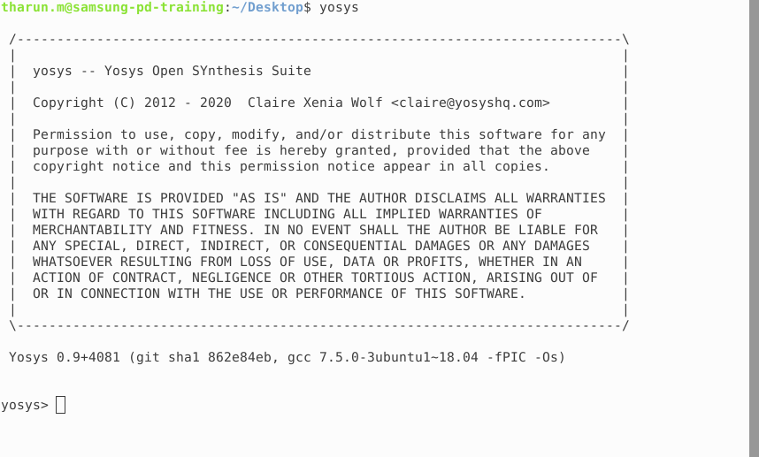

# Samsung-PD-Training
This github repository summarizes the progress made in the samsung PD training. Quick links:

- [Day-0-Tool-Check](#day-0-Tool-Check)
  
## Day-0-Tool-Check

 
 Summary 

Tool Check done for:
  >icc2_shell
  >pt_shell
  >dc_shell
  >lc_shell
  >Yosys
  >Gtkwave
  >Iverilog

	
	

 
 ICC2 Shell 

     
Below is the screenshot showing sucessful launch of icc2_shell:

 
 DC Shell 

     
Below is the screenshot showing sucessful launch of icc2_shell:

 
 PT Shell 

     
Below is the screenshot showing sucessful launch of icc2_shell:

 
 LC Tool 

     
Below is the screenshot showing sucessful launch of icc2_shell:

 

 
 Yosys Tool 

     
Below is the screenshot showing sucessful launch of icc2_shell:

 
 GTKWave Tool 

     
Below is the screenshot showing sucessful launch of icc2_shell:

 
 Iverilog Tool 

     
Below is the screenshot showing sucessful launch of icc2_shell:

